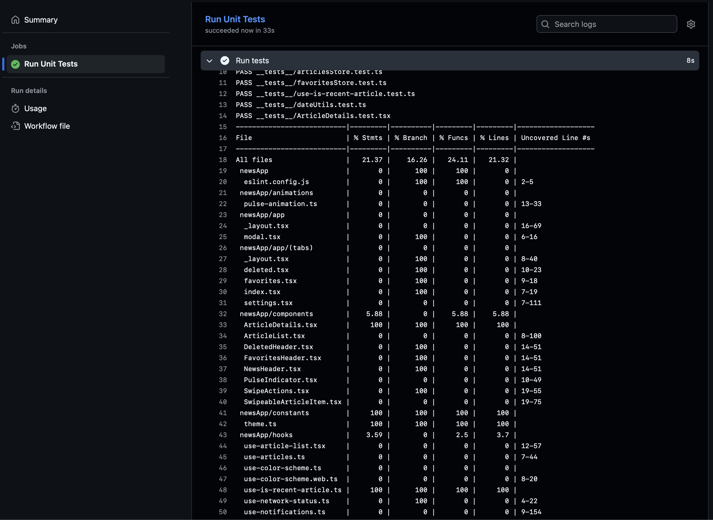
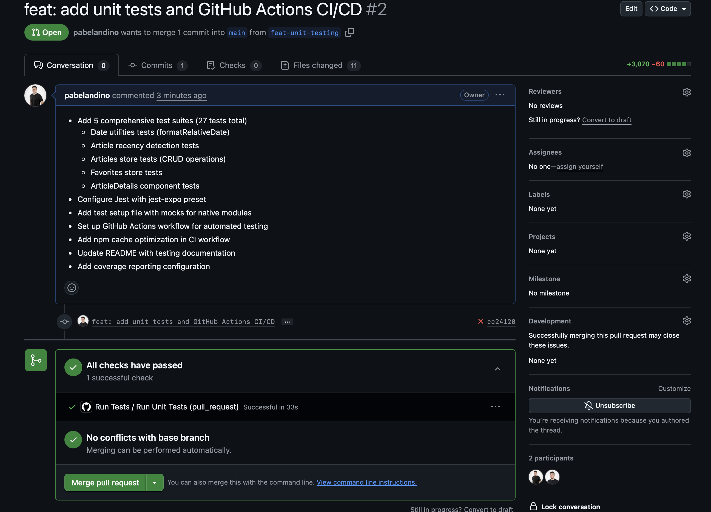

# NewsApp 📰

A modern React Native news application built with Expo, featuring offline support, push notifications, favorites management, and dark mode.

## Features

- 📱 **Offline Support**: View articles even when offline, with local data persistence
- 🔔 **Push Notifications**: Receive notifications for new articles matching your interests
- ⭐ **Favorites**: Save and manage your favorite articles
- 🗑️ **Swipe Actions**: Swipe to delete or favorite articles
- 🌙 **Dark Mode**: Automatic dark mode support following system preferences
- 📖 **Article Details**: View full article content in an in-app WebView
- 🧪 **Unit Tests**: Comprehensive test coverage with automated CI/CD

## Prerequisites

- Node.js 20 or higher
- npm or yarn
- iOS Simulator (for iOS development)
- Xcode (for running on physical iOS devices)
- Physical iOS device (required for push notifications)

## Installation

1. Clone the repository

   ```bash
   git clone https://github.com/pabelandino/newsApp.git
   cd newsApp
   ```

2. Install dependencies

   ```bash
   npm install
   ```

## Running the App

### Important: Native Modules Required

This project uses native modules (MMKV, WebView, Notifications, etc.), so it **cannot** run in Expo Go. You must use a development build.

### iOS Simulator

```bash
npm run ios
```

This will:
- Build the native iOS project
- Launch the iOS Simulator
- Install and run the app

### Physical iOS Device (Required for Push Notifications)

Push notifications only work on physical devices. To run on a physical iPhone:

1. **Enable Developer Mode on your iPhone**:
   - Go to Settings → Privacy & Security → Developer Mode
   - Enable Developer Mode
   - Restart your iPhone when prompted

2. **Connect your iPhone** to your Mac via USB

3. **Open the project in Xcode**:
   ```bash
   cd ios
   open NewsApp.xcworkspace
   ```

4. **In Xcode**:
   - Select your connected iPhone as the target device
   - Select your development team in Signing & Capabilities
   - Click the Run button (▶️) or press `Cmd + R`

Alternatively, you can use:

```bash
npm run ios:device
```

This will attempt to build and run on the connected device automatically.

### Android

```bash
npm run android
```

## Key Features

### Offline Mode

The app intelligently handles offline scenarios. When there's no internet connection, it displays locally saved articles instead of showing an error. A toast notification informs users that they're viewing cached data.

[](https://youtu.be/Jvd4p7mbpLg)

### Core Functionality

The app includes comprehensive features that work seamlessly:

- **Push Notifications**: Configure preferences and receive notifications for new articles
- **Favorites Management**: Swipe right to favorite articles, view them in the Favorites tab
- **Delete & Restore**: Swipe to delete articles, restore them from the Deleted tab
- **Article Details**: Tap any article to view full content in an in-app WebView modal
- **Settings**: Configure notification preferences and manage app settings

[](https://youtu.be/j59qsHO_aKY)

### Dark Mode

The app automatically adapts to your system's color scheme preference. All components, including articles, headers, and settings screens, support both light and dark modes.

## Testing

This project includes comprehensive unit tests to ensure reliability and code quality.

### Running Tests Locally

#### Run all tests (once)
```bash
npm test
```

#### Run tests in watch mode (recommended for development)
```bash
npm run test:watch
```

#### Run tests with coverage report
```bash
npm run test:coverage
```

### Test Coverage

The project includes 5 test suites covering:
- **Date utilities** (`formatRelativeDate`): Tests for date formatting logic
- **Article recency detection** (`useIsRecentArticle`): Tests for determining if articles are recent
- **Articles store**: Tests for article management, deletion, and restoration
- **Favorites store**: Tests for favorite article management
- **ArticleDetails component**: Tests for component rendering and display

**Total**: 27 tests across 5 test suites

### CI/CD Integration

Tests are automatically run on GitHub Actions for every push and pull request to the `main` branch. The CI pipeline includes:

- Automatic test execution
- Coverage report generation
- Artifact upload for coverage reports
- npm cache optimization for faster builds





## Project Structure

```
NewsApp/
├── app/                    # Expo Router screens
│   ├── (tabs)/            # Tab navigation screens
│   │   ├── index.tsx      # Home screen
│   │   ├── favorites.tsx  # Favorites screen
│   │   ├── deleted.tsx    # Deleted articles screen
│   │   └── settings.tsx   # Settings screen
│   └── article/[id].tsx    # Article detail screen
├── components/            # Reusable components
│   ├── ArticleDetails.tsx
│   ├── ArticleList.tsx
│   ├── SwipeableArticleItem.tsx
│   └── ...
├── hooks/                 # Custom React hooks
│   ├── use-articles.ts
│   ├── use-notifications.ts
│   └── ...
├── stores/               # Zustand state management
│   ├── articlesStore.ts
│   ├── favoritesStore.ts
│   └── notificationsStore.ts
├── services/             # API and service layers
│   ├── api.ts
│   └── notification-service.ts
├── utils/                # Utility functions
│   └── dateUtils.ts
├── constants/            # App constants
│   └── theme.ts
└── __tests__/            # Unit tests
```

## Technologies Used

- **React Native** - Mobile framework
- **Expo** - Development platform
- **Expo Router** - File-based routing
- **Zustand** - State management
- **MMKV** - Fast local storage
- **React Query** - Data fetching and caching
- **React Native Reanimated** - Animations
- **React Native Gesture Handler** - Gesture handling
- **Expo Notifications** - Push notifications
- **React Native WebView** - In-app web content
- **Jest** - Testing framework
- **React Native Testing Library** - Component testing

## Push Notifications Setup

1. **First Launch**: The app will automatically request notification permissions on first launch
2. **Settings**: Configure notification preferences in the Settings tab
3. **Background Fetch**: The app checks for new articles every 5 minutes (minimum)
4. **Physical Device**: Push notifications only work on physical devices, not simulators

## Data Persistence

- **Articles**: Stored locally using MMKV for fast access
- **Favorites**: Persisted across app restarts
- **Deleted Articles**: Maintained in local storage with restore capability
- **Notification Preferences**: Saved locally and synced

## Development

### Code Style

- TypeScript for type safety
- ESLint for code quality
- Consistent component structure
- Centralized color management

## License

This project is private and proprietary.

## Learn More

- [Expo Documentation](https://docs.expo.dev/)
- [React Native Documentation](https://reactnative.dev/)
- [Expo Router Documentation](https://docs.expo.dev/router/introduction/)
